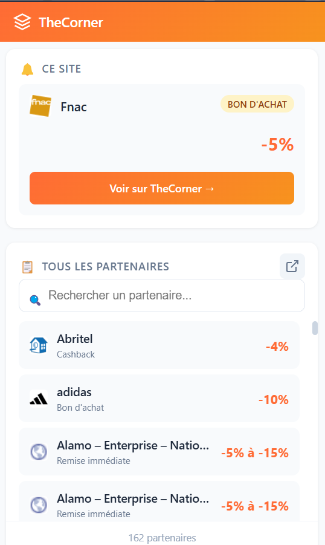

#  TheCorner - Extension Chrome

Extension Chrome non-officielle qui détecte automatiquement les sites partenaires **TheCorner** de Boursorama et affiche les réductions disponibles.

  

<p align="center">
  
</p>

## ✨ Fonctionnalités

- 🔔 **Notification automatique** sur les sites partenaires avec le montant du cashback
- 📋 **Popup** avec détection du site actuel + liste searchable de tous les partenaires
- 🗂️ **Page partenaires** complète avec filtres (Cashback / Bon d'achat / Remise)
- 🖼️ **Logos** des partenaires via Google Favicon API
- 🔗 **Liens directs** vers les pages TheCorner spécifiques
- ❌ Option "Ne plus afficher sur ce site"

## ⚠️ Avertissement Important

> **Cette extension utilise des données hardcodées et non temps réel.**
> 
> Les informations sur les partenaires, réductions et types d'offres ont été scrapées manuellement depuis le site TheCorner. Elles peuvent être **incomplètes, obsolètes, ou incorrectes**.
> 
> Cette extension n'est **pas affiliée** à Boursorama ou TheCorner.

## 📦 Installation

1. Télécharger ou cloner ce repository
2. Ouvrir `chrome://extensions/` dans Chrome
3. Activer le **Mode développeur** (toggle en haut à droite)
4. Cliquer **"Charger l'extension non empaquetée"**
5. Sélectionner le dossier du projet

## 🧪 Sites de test

- [fnac.com](https://fnac.com) • [darty.com](https://darty.com) • [ikea.fr](https://ikea.fr)
- [decathlon.fr](https://decathlon.fr) • [nike.com](https://nike.com) • [zalando.fr](https://zalando.fr)

## 📁 Structure

```
thecorner-extension/
├── manifest.json        # Configuration Chrome Manifest V3
├── partners.js          # Base de données des 163 partenaires (hardcodée)
├── content.js           # Script de détection + notification
├── styles.css           # Styles de la notification
├── popup.html/css/js    # Interface popup
├── partners-page.*      # Page complète des partenaires
└── icons/               # Icônes de l'extension
```

## 🔄 Mise à jour des partenaires

Les partenaires sont stockés dans `partners.js`. Pour mettre à jour :

1. Se connecter sur [TheCorner](https://clients.boursobank.com/thecorner/toutes-les-offres)
2. Scraper les nouvelles données
3. Mettre à jour `partners.js`

## 📄 Licence

MIT - Projet à but éducatif uniquement.

## License

Licensed under the [MIT License](LICENSE).
